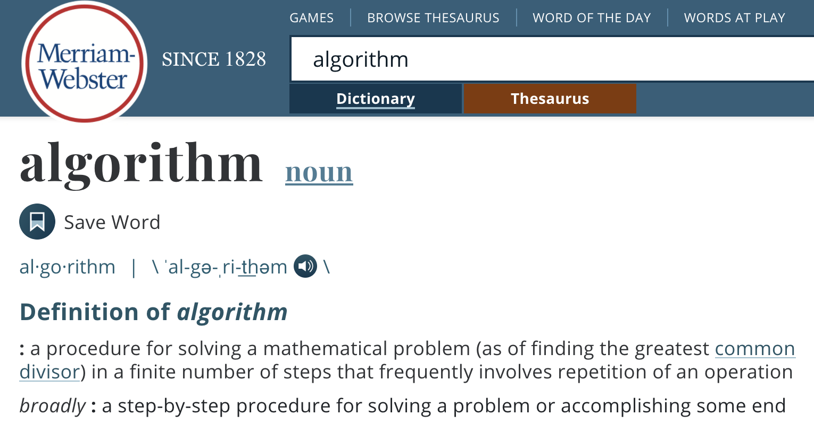
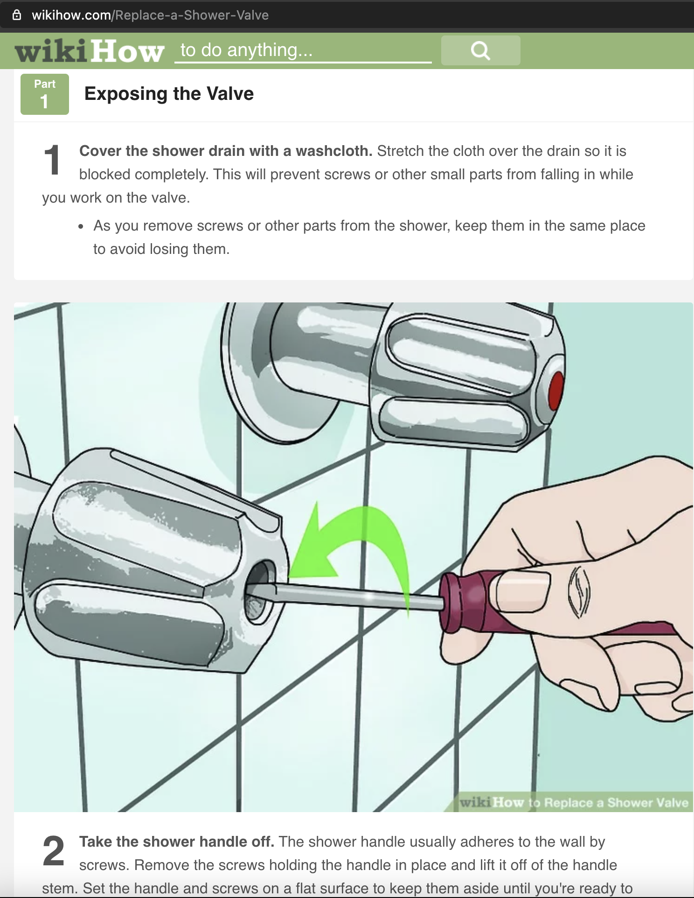

class: center, middle

# Algorithms as documents

Timothy Brathwaite  
January 2021

---

## Algorithms: what they are

---

## Algorithms: where they are

---

## Algo aliases: instructions

---

## Algo's: why they matter

Algorithms can be key to solving the problems of the

---

## Algo's: How to proceed

 Algorithms are valuable, <e>document</e> them.

<e>
Store</e> them; don't lose them.  

Remember, "<e>spread</e> love, it's the [Brooklyn](https://www.youtube.com/watch?v=_JZom_gVfuw) way."
